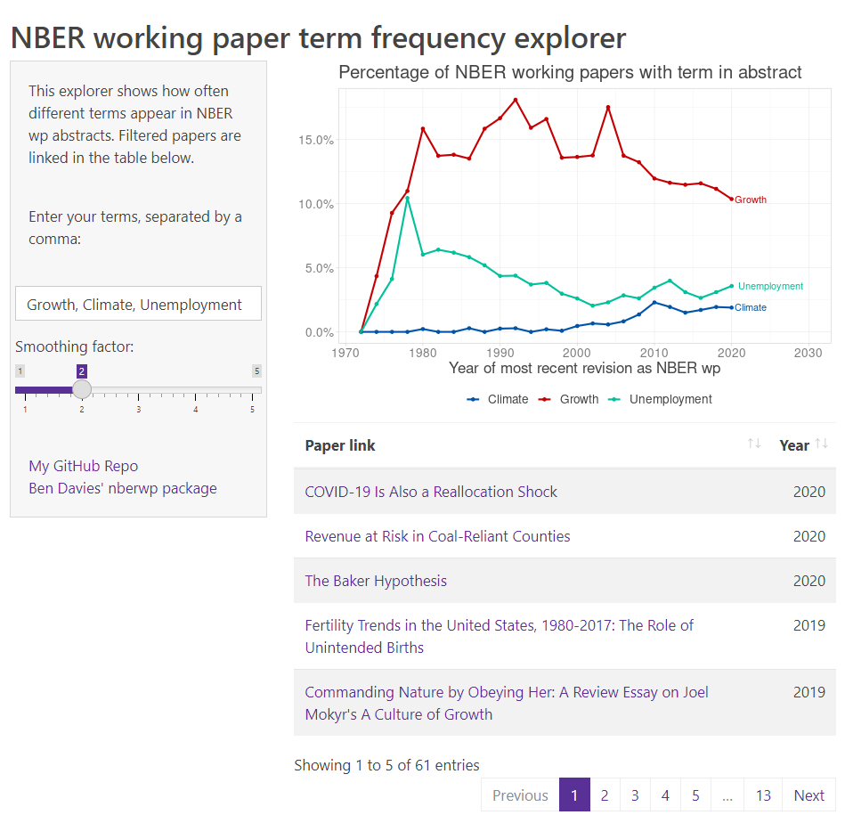

# NBER methods

## Purpose

Parse and visualize methods from NBER Abstracts

There is a long tradition of economists being seriously concerned about the methods used to answer their questions, sometimes with even more concern that the answers to their questions. It has been documented since [Richard S. Thorn's *The Methodologies of Economists: A Survey*](https://www.jstor.org/stable/40324748?seq=1#metadata_info_tab_contents).

There is a figure produced by [The Economist](https://www.economist.com/finance-and-economics/2016/11/24/economists-are-prone-to-fads-and-the-latest-is-machine-learning) about the latest fad in the discipline being machine learning.

The figure is constructed in 2016. I want to update it.

## Planning

I want to collect the NBER abstracts over time, and then parse them for different methods, and maybe have a look at the JEL codes over time.

### Packages

Ben Davies from Stanford has created a nice R package that has details about all of the NBER papers. You can access it [here](https://github.com/bldavies/nberwp)

## Progress

I have scraped the abstract content from the NBER website for nearly 30,000 papers. I've made a Shiny App that displays the frequency of terms you input over time. You can see what it looks like below and use it [here](https://jonathan-jayes.shinyapps.io/NBER-Explorer/)

I may in time improve upon it, perhaps by doing some CI scraping to keep it up to date, but for now I think this is fine.

## Useage

People have even used it! Sevrin Waights shared a [plot on twitter](https://twitter.com/waights/status/1458550407022661644) looking at the decline of instrumental variables mentions over time.
