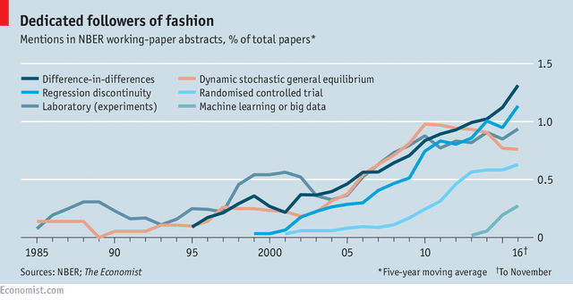

# NBER-methods
Parse and visualize methods from NBER Abstracts

There is a figure produced by [The Economist](https://www.economist.com/finance-and-economics/2016/11/24/economists-are-prone-to-fads-and-the-latest-is-machine-learning) about the latest fad in the discipline being machine learning.

The figure is constructed in 2016. I want to update it.

## Planning

I want to collect the NBER abstracts over time, and then parse them for different methods, and maybe have a look at the JEL codes over time.

### Packages

Ben Davies from Stanford has created a nice R package that has details about all of the NBER papers. I'll start there.
